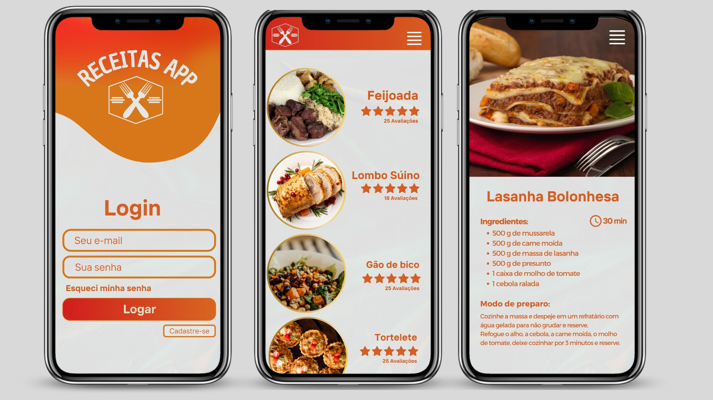

 
<h1>Receitas App</h1>

<<<<<<< HEAD
O projeto Receitas App é uma aplicação BackEnd em JavaScript, usando Node.js e Banco de dados Mongo DB. Ele permite realizar operações CRUD para manipular dados do usuário no banco de dados atuando como um repositório culinário online e oferecendo uma plataforma interativa dedicada ao mundo das receitas. Com foco nas atividades de administração e uso, o aplicativo possui um backend robusto que permite aos administradores adicionar, consultar, editar e remover receitas. Os usuários têm à disposição funcionalidades para explorar receitas de maneira eficiente, incluindo a capacidade de buscar pratos por nome e categoria, também podem avaliar as receitas com avaliações em forma de estrelas.
=======
O projeto Receitas App é uma aplicação BackEnd em JavaScript, usando Node.js e Banco de dados Mongo DB. Ele permite realizar operações CRUD para manipular dados das receitas e dos usuarios no banco de dados atuando como um repositório culinário online e oferecendo uma plataforma interativa dedicada ao mundo das receitas. Com foco nas atividades de administração e uso, o aplicativo possui um backend robusto que permite aos administradores adicionar, consultar, editar e remover receitas. Os usuários têm à disposição funcionalidades para explorar receitas de maneira eficiente, incluindo a capacidade de buscar pratos por nome e categoria, também podem avaliar as receitas com avaliações em forma de estrelas.
>>>>>>> 7c2a48cbf53532c2c4801b2c20471fa3a3752c75

#### [ :pencil: Acessar Documentação Tecnica](/documentacao.md)

